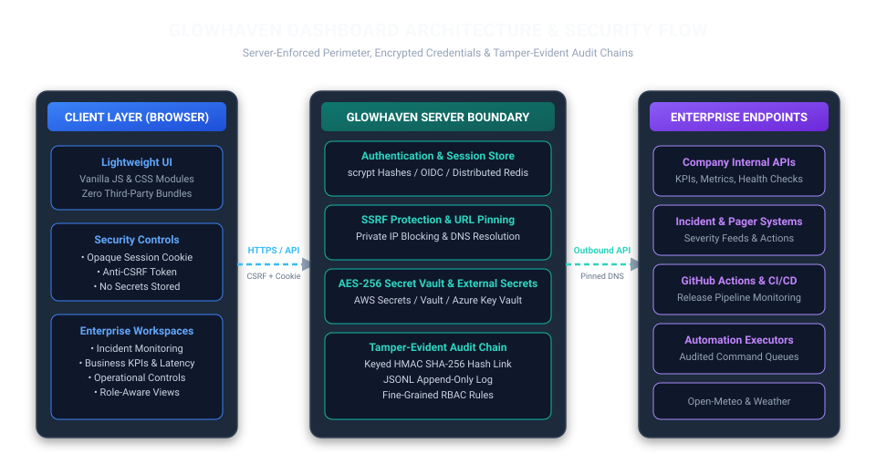

# Glowhaven Dashboard

> **A secure, self-hosted operations command center for modern companies.**

**Monitor. Understand. Coordinate. Act.**

Glowhaven Dashboard puts the operational signals a company cares about into one fast, modular workspace: business KPIs, incidents, service health, workflows, team activity, calendars, GitHub Actions, and controlled automation.

It is designed around a simple rule:

**The browser displays company data. The server owns credentials and protected actions.**

---

## Why Glowhaven?

Most dashboards stop at charts.

Glowhaven is built to be the operational layer that connects the systems a company already uses while keeping sensitive credentials and privileged actions on the server.

### Built for real company environments

- 🔐 Server-side authentication with expiring sessions
- 🛡️ Server-enforced role authorization
- 🔑 Encrypted integration secrets with AES-256-GCM
- 🚫 CSRF protection on mutating requests
- 🌐 SSRF defenses for remote integration targets
- 🧾 Tamper-evident audit logging with a hash chain
- 🔒 Production security headers and HSTS
- 🔑 Optional enterprise OIDC SSO with PKCE
- ⚙️ Controlled automation execution with audited actions
- 🧩 Modular workspaces with role-aware controls
- 🐳 Docker deployment with persistent application storage
- ✅ Automated regression and security checks in GitHub Actions

---

## What you can connect

Glowhaven intentionally keeps integrations generic so teams can connect existing systems without rebuilding the dashboard.

| Module | Purpose |
| --- | --- |
| **Business KPIs** | Show company metrics from an internal JSON endpoint |
| **Incident Center** | Surface active incidents and severity |
| **Service Health** | Monitor service endpoints, availability, and latency |
| **Automation Queue** | View jobs and trigger permitted automation actions |
| **Team Activity** | Pull operational activity from company or GitHub sources |
| **Calendar** | Google Calendar, Outlook-style endpoints, or GitHub activity |
| **Release Pipelines** | Monitor GitHub Actions for configured repositories |
| **Local Conditions** | Weather and air-quality data from Open-Meteo |
| **Workspaces** | Operations and Team layouts with customizable modules |

---

## Security model

Glowhaven is designed so important controls live on the backend rather than only in the UI.

### Authentication

Local accounts use salted, memory-hard scrypt password hashes.

Sessions use random opaque tokens. Only the session hash is stored in application state, and sessions expire automatically.

Optional OIDC SSO uses:

- Authorization Code flow
- PKCE with S256
- State validation
- Nonce validation
- HTTPS-only provider metadata
- ID token signature validation through provider JWKS
- Issuer, audience, expiry, nonce, email verification, and authorized-party checks

### Authorization

The UI can hide controls for convenience, but it is **not** the security boundary.

The server enforces permissions for:

- Viewer access
- Operational execution
- Company administration
- User administration
- Audit access

### Secret storage

Integration credentials are never written to browser local storage.

Secrets are encrypted server-side with AES-256-GCM using a deployment-specific 32-byte master key.

The browser receives integration metadata and configuration needed for the interface, but not stored secret values.

### SSRF protection

Remote integration endpoints are validated before requests are made.

Production defaults block private and local network targets, including common IPv4 and IPv6 private, loopback, link-local, multicast, and IPv4-mapped IPv6 ranges.

Endpoints containing embedded credentials or sensitive credential query parameters are rejected.

Outbound DNS resolution is checked and the selected resolved address is pinned for the request.

### Auditability

Administrative changes, authentication events, user creation, integration changes, organization changes, and automation execution are written to an append-only JSONL audit stream.

Each record is linked to the previous record with a keyed SHA-256 hash.

The audit API verifies the chain before returning records.

---

## Architecture

The frontend stays intentionally lightweight. There is no required frontend framework or bundler.

---

## Quick start

### 1. Clone

~~~bash
git clone https://github.com/GlowhavenIndustries/Glowhaven-Dashboard.git
cd Glowhaven-Dashboard
~~~

### 2. Start locally

~~~bash
npm start
~~~

Open:

~~~text
http://localhost:5173
~~~

On the first launch, Glowhaven creates the initial owner account.

### 3. Configure your company

Open **Company settings** and configure the integrations your team needs.

For local development, Glowhaven can create a local master key automatically.

For production, provide a real deployment secret:

~~~bash
export GLOWHAVEN_MASTER_KEY="$(openssl rand -hex 32)"
~~~

The key must be **64 hexadecimal characters** representing 32 bytes.

---

## Production deployment

Docker is included:

~~~bash
export GLOWHAVEN_MASTER_KEY="$(openssl rand -hex 32)"
docker compose up -d --build
~~~

For production:

1. Put Glowhaven behind HTTPS.
2. Store GLOWHAVEN_MASTER_KEY in your deployment secret manager.
3. Persist GLOWHAVEN_DATA_DIR.
4. Keep GLOWHAVEN_ALLOW_PRIVATE_NETWORK=0 unless private integration targets are deliberately required.
5. Configure OIDC when enterprise SSO is needed.

### OIDC configuration

Set:

~~~text
OIDC_ISSUER=
OIDC_CLIENT_ID=
OIDC_CLIENT_SECRET=
OIDC_REDIRECT_URI=https://your-company.example.com/api/auth/oidc/callback
OIDC_SCOPE=openid profile email
OIDC_ADMIN_EMAILS=
OIDC_ADMIN_GROUPS=
~~~

---

## Roles

| Role | Access |
| --- | --- |
| **Owner** | Full administration and operational control |
| **Admin** | Company settings, users, integrations, audit access |
| **Operator** | Permitted operational actions |
| **Viewer** | Read-only operational access |

Role checks are enforced on the server.

---

## Development

Glowhaven uses Node.js and the built-in test runner.

### Run development mode

~~~bash
npm run dev
~~~

### Validate syntax and repository checks

~~~bash
npm run check
~~~

### Run tests

~~~bash
npm test
~~~

GitHub Actions runs the validation and test suite on pushes to main and on pull requests targeting main.

---

## Repository layout

~~~text
.
├── app.js
├── dataSources.js
├── index.html
├── styles.css
├── server.js
├── server/
│   ├── auth.js
│   ├── oidc.js
│   ├── security.js
│   └── storage.js
├── widgets/
│   ├── calendar.js
│   ├── githubProjects.js
│   ├── operations.js
│   ├── serverStatus.js
│   └── weather.js
├── tests/
│   ├── audit.test.js
│   └── security.test.js
├── Dockerfile
├── docker-compose.yml
└── .github/
    └── workflows/
        └── ci.yml
~~~

---

## Integration contract

Company endpoints should return JSON.

A KPI endpoint can return:

~~~json
{
  "metrics": [
    {
      "label": "Revenue",
      "value": "$42k",
      "change": "+8%"
    }
  ]
}
~~~

An incident endpoint can return:

~~~json
{
  "incidents": [
    {
      "id": "incident-123",
      "title": "API latency",
      "status": "open",
      "severity": "high"
    }
  ]
}
~~~

The integration layer is intentionally generic. Your existing systems remain the source of truth.

---

## Why fork Glowhaven?

Fork it when you want an operations surface that you can shape around your company instead of forcing your workflows into someone else's dashboard.

Glowhaven is small enough to understand, simple enough to self-host, and structured so the backend security boundary stays clear.

Good fork targets include:

- Internal operations portals
- Engineering command centers
- Service health dashboards
- Incident rooms
- Executive operational views
- Controlled automation consoles
- Company-specific integration hubs

Build the interface around your organization, then keep your existing systems as the underlying source of truth.

---

## Project principles

**Secure by default.**

Protected operations belong on the server.

**Self-hosted by design.**

Keep company data and credentials inside infrastructure you control.

**Modular without bloat.**

Add the operational modules your team actually needs.

**Readable code over unnecessary complexity.**

Glowhaven uses a small Node.js server and browser-native frontend patterns.

**Audit what matters.**

Administrative and privileged actions should leave a trace.

---

## Roadmap

Glowhaven's architecture leaves room for future enterprise improvements such as:

- Managed database storage
- Distributed session storage
- More identity providers
- Additional integration adapters
- Expanded audit reporting
- Organization-level workspace templates
- Deeper automation policy controls

The current project favors a compact, understandable foundation that teams can extend.

---

## License

Glowhaven Dashboard is licensed under the [Apache License, Version 2.0](LICENSE).

---

## Built by GlowhavenIndustries

**Building the future, on our terms.**

Glowhaven Dashboard is an open-source-oriented foundation for company operations, built around a simple idea:

**Your systems own the data. Glowhaven owns the operational surface.**

⭐ **Star the repo to follow the project. Fork it to build your own company command center.**
